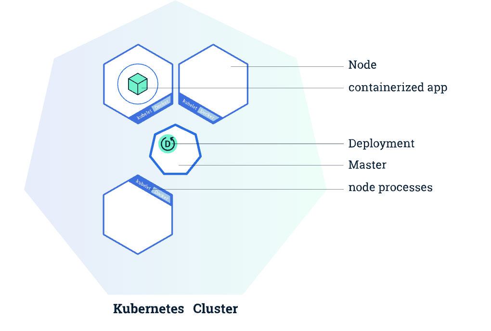

# KFServing

KFServing provides a Kubernetes [Custom Resource Definition](https://kubernetes.io/docs/concepts/extend-kubernetes/api-extension/custom-resources/) for serving machine learning (ML) models on arbitrary frameworks.


### Kubernetes Clusters

Kubernetes coordinates a highly available cluster of computers that are connected to work as a single unit. It automates the distribution and scheduling of application containers across a cluster in a more efficient way.

A Kubernetes cluster consists of two types of resources:

1. The **Master** coordinates the cluster. The Master is responsible for managing the cluster.
2. **Nodes** are the workers that run applications. A node is a VM or a physical computer that serves as a worker machine in a Kubernetes cluster.

``` bash
# Create a Cluster
minikube start # start to run Kubernetes
kubectl version # kubectl: interacting with Kubernetes
kubectil get nodes # Show all nodes that can be used to host the applications

```

We can deploy the containerized applications on top of it. To do so, you create a Kubernetes **Deployment** configuration. It instructs Kubernetes how to create and update instances of your application.



``` bash
# common format: kubectl [action] [resource]
kubectl create deployment kubernetes-bootcamp --image=gcr.io/google-samples/kubernetes-bootcamp:v1
kubectl get deployments # List the deployments
```


 A Pod is a Kubernetes abstraction that represents a group of one or more application containers (such as Docker), and some shared resources for those containers. Resources are:

1. Shared storage, as Volumes
2. Networking, as a unique cluster IP address
3. Information about how to run each container, such as the container image version or specific ports to use

A Pod always runs on a **Node**. A Node is a worker machine in Kubernetes and may be either a virtual or a physical machine, depending on the cluster.


``` bash
kubectl get namespaces
kubectl get pods -n [namespace]
kubectl describe pods
```

### Knative & Istio
KFServing currently requires Knative Serving for auto-scaling, canary rollout, Istio for traffic routing and ingress.

Knative & Lstio are foundmental layers for serverless and networking.


Knative provides a set of building blocks that enable declarative, container-based, serverless workloads on Kubernetes. Knative Serving proves primitives for serving platforms such as:

1. Event triggered functions on Kubernetes
2. Scale to and from zero
3. Queue based autoscaling for CPUs and TPUs. KNative autocaling by default provies inflight requests per pod
4. Traditional CPU autoscaling if desired. Traditional scaling hard for disparate devices (GPU, CPU, TPU)


Istio: An open service mesh platform to connect, observe, secure and control microservices.

### Architecture


